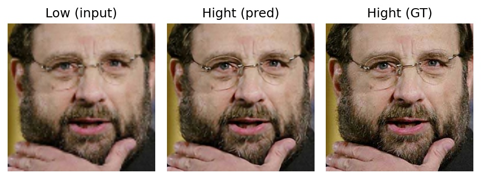
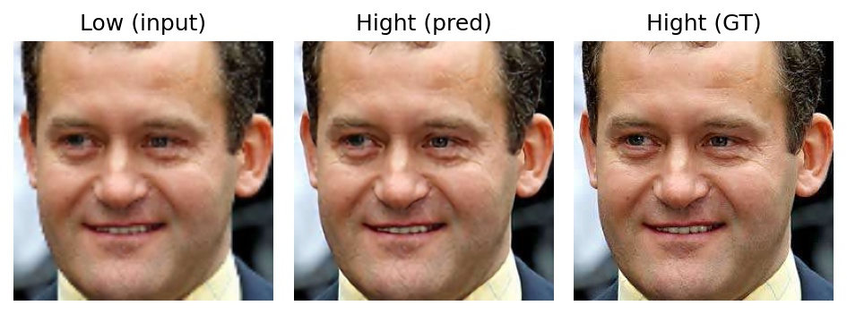
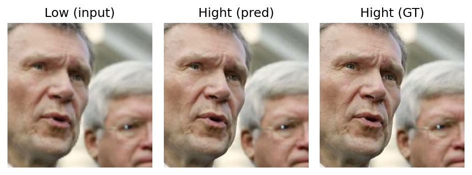
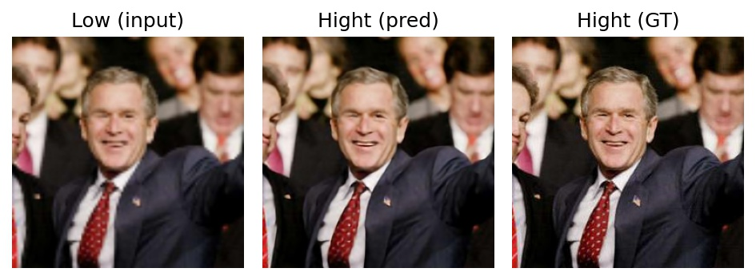

# SuperResolution with AutoEncoder [Keras inplementation]

This is a code to increase the resolution of low-resolution images.

You can see more specific code examples and explanations.

- [Image Super-Resolution using Convolution Neural Networks and Auto-encoders](https://towardsdatascience.com/image-super-resolution-using-convolution-neural-networks-and-auto-encoders-28c9eceadf90)
- [Super-Resolution Using Autoencoders and TF2.0](https://medium.com/analytics-vidhya/super-resolution-using-autoencoders-and-tf2-0-505215c1674)
- [Image Super Resolution Using Autoencoders in Keras](https://www.coursera.org/projects/image-super-resolution-autoencoders-keras)

## Quick start

You can run an example code below for experimenting image resolution enhancement using AE architechture on GPU or CPU.

```sh
python main.py --data_path [Dataset] --save_path [Save Folder]
```

## Example Result

After running main.py, test figures image-enhanced by AE, the model and 1 log file are made in `save_path` folder by default. 

The test figures result are below.
Left image is low resolution image which is input data.
Center image is enhanced image by AE.
Right image is Ground Truth.
These results are in Result folder.

Here, the results of experiment using dataset [1] are showed.

Sorry,Typo **"Hight" → "High"**







## References

[1] Vidit Jain and Erik Learned-Miller.FDDB: A Benchmark for Face Detection in Unconstrained Settings.Technical Report UM-CS-2010-009, Dept. of Computer Science, University of Massachusetts, Amherst. 2010.
